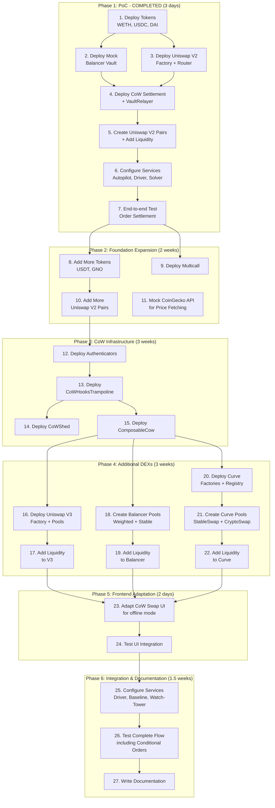
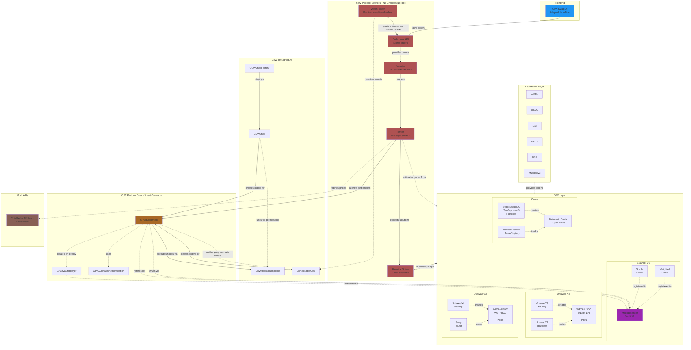

- Bug fixes and security updates
- Documentation updates as needed

Requests for proposals are not intended to be prescriptive or exhaustive. The community is encouraged to submit proposals that expand upon the ideas presented in this post. The scope of the project may change based on the proposals received. The primary intent of this document is to provide a starting point to achieve the outlined goals, and the final implementation may differ from the initial proposal.

# Grant Application: CoW Playground Offline Development Mode

---

**Grant Title:**

CoW Playground Offline Development Mode

## Author Information

**Team:** @bleu @yvesfracari @ribeirojose @mendesfabio @lgahdl

**About Us:**
bleu collaborates with companies and DAOs as a web3 technology and user experience partner. We're passionate about bridging the experience gap we see in blockchain and web3.

**Our work for CoW so far:**

[CoW] Python SDK: Python SDK for querying on-chain data, managing orders, and integrating with the CoW Protocol's smart contracts.

[CoW] [Framework Agnostic SDK](https://forum.cow.fi/t/grant-application-framework-agnostic-sdk/2811): Restructured SDK architecture to be more composable with framework-agnostic base packages with EVM adapters.

[CoW] [Hook dApps](https://forum.cow.fi/t/grant-application-cow-hooks-dapps/2544/7): a set of Hook dApps integrated on the CoW Swap frontend. During this project, we developed the `cow-shed` module of the `@cowprotocol/cow-sdk`. This module was created to help developers use [CoW Shed](https://github.com/cowdao-grants/cow-shed/tree/main) to create permissioned hooks.

[CoW] [**Improving Solver Infrastructure Onboarding**](https://forum.cow.fi/t/retro-round-improving-solver-infrastructure-onboarding/3197) (retro round proposal): We propose to improve solver infrastructure and onboarding through updating the solver template, creating a Python baseline, examples & tests, documentation refresh, and tooling & scripts.

---

# Simple Summary

The CoW Protocol Playground currently operates using blockchain forks, requiring constant network access to an archive node. This proposal delivers a **self-contained offline development mode** that allows developers to work without external dependencies while testing solver strategies with realistic DEX liquidity and token pairs.

# Goal

This proposal addresses the critical need for a lightweight, self-contained development environment for CoW Protocol. The current fork-based playground creates barriers for developers due to:

- High infrastructure costs (archive node access)
- Network dependency and latency issues
- Difficulty reproducing specific test scenarios
- Complex setup process for new developers

**Benefits for the CoW Ecosystem:**

- **Lower Barriers to Entry:** Developers can start building on CoW Protocol immediately without complex infrastructure setup
- **Improved Testing:** Deterministic, reproducible test scenarios for solver development
- **Cost Reduction:** Eliminate ongoing archive node costs for development
- **Faster Innovation:** Accelerate development cycles with instant blockchain state and fast block times
- **Educational Value:** Provide a complete reference implementation for understanding CoW Protocol architecture

# **Milestones**

| Milestone | Duration | Payment (xDAI) |
| --- | --- | --- |
| **M1 — Proof of Concept (PoC)** | **3 days** | **1,800 xDAI** |
| **M2 — Foundation Expansion** | **2 weeks** | **6,000 xDAI** |
| **M3 — CoW Infrastructure Deployment** | **4 weeks** | **12,000 xDAI** |
| **M4 — Additional DEX Integrations (Uniswap V3, Balancer, Curve)** | **3 weeks** | **9,000 xDAI** |
| **M5 — Frontend Adaptation** | **1.5 weeks** | **4,500 xDAI** |
| **M6 — Integration, Testing & Documentation** | **1.5 weeks** | **4,500 xDAI** |
| **Maintenance** | 1 year | **37,800 COW** |

**Total Duration:** 12.6 weeks

**Total Funding:** **37,800 xDAI**

**Maintenance Vesting: 37,800 COW over 1 year**

# Specification

## M1: Proof of Concept - COMPLETED

The PoC phase validated the core concept by establishing a minimal working environment.

- Deploy fundamental contracts (with persistent state): Tokens, UniswapV2, BalancerVault(Mocked), GPv2Settlement.
- Create a Docker Compose for offline mode.
- Execute end-to-end order settlement tests

**Outcome:** Validated that CoW Protocol services work seamlessly with a local blockchain without code modifications.

## M2: Foundation Expansion

Expand the foundational layer for a realistic trading environment:

- Add additional tokens (USDT, GNO)
- Deploy MulticallV3 for efficient batch queries
- Create additional Uniswap V2 pairs
- Implement CoinGecko API mock for price fetching

**Goal:** Establish a token ecosystem mirroring real-world scenarios.

## M3: CoW Infrastructure

Deploy advanced CoW Protocol infrastructure:

- CoWHooksTrampoline
- CoWShed factory and implementations
- ComposableCoW for programmatic orders

**Goal:** Enable advanced features like conditional orders, hooks, and Safe integration.

## M4: Additional DEXs

Expand DEX liquidity sources for solver optimization:

**Uniswap V3:**

- Factory, Router, Position Manager
- concentrated liquidity pools

**Balancer:**

- Replace the mocked vault deployment by the real one
- Create Weighted and Stable pools

**Curve:**

- AddressProvider, MetaRegistry, and factories
- StableSwap and CryptoSwap pools

**Goal:** Provide multiple liquidity sources for optimal settlement paths.

## M5: Frontend Adaptation

Adapt CoW Swap UI for offline environment:

- Configure frontend for Anvil chain (chain ID 31337, local RPC)
- Test order submission, signing, and status tracking

**Goal:** Provide complete user-facing interface for testing.

## M6: Integration & Documentation

Final integration and comprehensive documentation:

- Configure Driver, Baseline Solver and Watch-Tower
- Comprehensive end-to-end tests:
    - Regular limit and market orders
    - Conditional orders via ComposableCoW
    - Hook execution via CoWHooksTrampoline
    - Multi-DEX settlements (Balancer, Uniswap V2/V3, Curve)
    - Safe-based trading via CoWShed
- Documentation

## **Maintenance Vesting**

- Bug fixes and security updates
- Documentation updates as needed
- Minor feature adjustments based on feedback

**Goal:** Deliver a production-ready environment with clear documentation.

# **Deliverables**

Our proposal directly addresses all RFP requirements with comprehensive deliverables:

## Core Deliverables

### 1. Self-Contained Blockchain (RFP Requirement)

- **Local Anvil blockchain** that doesn't require forking or external network access
- Complete offline operation without archive node dependencies
- Fast startup times (seconds, not minutes)
- Minimal resource usage compared to fork mode

### 2. State Management (RFP Requirement)

- **Import/export capabilities** for chain state using Anvil's state dump/load features
- Easy state reset to predefined configurations
- JSON-based state snapshots for reproducible testing scenarios
- Quick environment restoration (< 5 seconds)

### 3. Contract Deployments (RFP Requirement)

**All necessary CoW Protocol contracts pre-deployed:**

- **Core:** GPv2Settlement, GPv2VaultRelayer, Authenticators
- **Hooks:** CoWHooksTrampoline for pre/post-settlement hooks
- **CoW Shed:** Factory and implementation contracts for Safe integration
- **ComposableCoW:** Programmatic order contracts for conditional orders

### 4. DEX Infrastructure (RFP Requirement)

**Common DEX contracts with realistic liquidity:**

- **Balancer V2:** Vault, Weighted Pools, Stable Pools with configured liquidity
- **Uniswap V2:** Factory, Router, multiple trading pairs with liquidity
- **Uniswap V3:** Factory, Router, Position Manager, concentrated liquidity pools
- **Curve:** AddressProvider, MetaRegistry, StableSwap-NG, TwoCrypto-NG factories with pools
- Compatible with existing solver implementations
- Sufficient liquidity for realistic solver testing and strategy development

### 5. Test Tokens (RFP Requirement)

**Pre-configured tokens with liquidity pools:**

- WETH, USDC, DAI, USDT, GNO
- Established pools for common pairs (WETH-USDC, WETH-DAI, etc.)
- Pre-funded test accounts for immediate testing
- Sufficient balances for solver testing scenarios

### 6. Configuration (RFP Requirement)

**Easy switching and setup:**

- `docker-compose.offline.yml` - Complete service orchestration including:
    - Anvil local blockchain node
    - Autopilot, Driver, OrderBook API, Baseline Solver
    - Watch-Tower for monitoring ComposableCoW orders
    - CoinGecko API mock server
- Configuration alongside existing fork mode setup
- Template-based configuration files for all services
- One-command startup: `docker-compose -f docker-compose.offline.yml up`

### 7. Mock External APIs (Additional)

- CoinGecko API mock server for offline price fetching
- Configurable price feeds for testing price-dependent features
- Eliminates external API dependencies
- **Timeline:** Phase 2 (included in 2 weeks)

### 8. Frontend Adaptation (Additional)

- CoW Swap UI configuration for Anvil chain (chain ID 31337)
- Local token list and metadata
- RPC and API endpoint configuration
- Complete end-to-end user experience testing

### 9. Documentation (RFP Requirement)

**Comprehensive setup and usage instructions:**

- Setup guide for Docker and local development
- Configuration reference for all services (Driver, Baseline, Watch-Tower)
- State management guide (import/export, reset procedures)
- Testing scenarios and examples
- Architecture overview with component interactions
- Troubleshooting guide for common issues

## Proof of Concept (Completed)

A functional PoC has been completed and validated, demonstrating:

- Local Anvil blockchain with CoW Protocol core contracts
- Uniswap V2 DEX with liquidity
- Working Autopilot, Driver, and Baseline Solver
- Successful end-to-end order settlement

## Deployment Diagram

## Architecture Diagram

**Note:** Services in pink/red (Autopilot, Driver, Orderbook, Baseline Solver, Watch-Tower) are existing CoW Protocol services that require **no code changes**. They work out of the box with proper configuration. The CoinGecko API Mock (gold) is a new mock service we'll deploy for offline price fetching.

# Method

## Technical Approach

We are proposing a comprehensive deployment-based approach that deploys essential contracts from scratch and persists the anvil state in a JSON file, to be reused without having to deploy the contracts again. The deploy script will also autogenerate `driver.toml` and `baseline.toml` files, as well as any other configuration file necessary.

## Implementation Strategy

1. **Contract Deployment:** Use Foundry scripts for deterministic deployments
2. **Service Configuration:** Template-based configuration files for all services
3. **Docker Orchestration:** Single `docker-compose.offline.yml` for a complete environment
4. **State Management:** JSON-based initial state for quick environment reset
5. **Testing Framework:** Comprehensive test suite validating all components

## Open Source Commitment

All code will be open-source from day 0. We're open to feedback during PRs and will maintain the codebase according to CoW Protocol standards.

## Long-term Sustainability

**Maintenance Plan:**

- 1-year maintenance through COW token vesting (37,800 COW)
- Bug fixes and security updates
- Documentation updates as needed
- Community support and issue triage

**Community Ownership:**

- All code will be contributed to CoW Protocol repositories
- Documentation will enable community contributions
- Clear architecture enables future extensions

# Evaluation Criteria

Per the RFP, our proposal addresses all evaluation criteria:

## 1. Technical Approach

- **Anvil blockchain selection:** Fast, deterministic, well-documented, and widely adopted in Ethereum development
- **Foundry deployment scripts:** Reproducible, version-controlled contract deployments
- **Docker Compose orchestration:** Industry-standard containerization for easy distribution
- **JSON state management:** Simple import/export capabilities for state snapshots
- **Proven in PoC:** Working implementation validates technical feasibility

## 2. Resource Efficiency

- **Minimal footprint:** ~MB of storage (vs ~GB for fork mode)
- **Fast startup:** Complete environment ready in seconds
- **Low memory usage:** No archive node requirements
- **CPU efficient:** Local blockchain requires minimal computational resources
- **Cost savings:** Eliminates ongoing archive node access costs (~$500-1000/month)

## 3. Ease of Use

- **One-command startup:** `docker-compose -f docker-compose.offline.yml up`
- **Works alongside fork mode:** No disruption to existing workflows
- **Pre-configured:** No manual contract deployment or liquidity setup needed
- **State reset:** Quick environment restoration for clean testing
- **Comprehensive documentation:** Step-by-step guides for all use cases

## 4. Solver Compatibility

- **No code changes required:** Existing solvers work out-of-the-box
- **Realistic liquidity:** Sufficient depth for solver strategy testing
- **Multiple DEX protocols:** Balancer V2, Uniswap V2/V3, Curve coverage
- **Standard interfaces:** All contracts follow production specifications
- **PoC validated:** Current Baseline solver successfully finding settlements

## 5. DEX and Liquidity Configuration

- **4 major DEX protocols:** Comprehensive coverage of solver liquidity sources
- **Realistic liquidity depths:** Based on mainnet proportions for authentic testing
- **Common trading pairs:** WETH-USDC, WETH-DAI, stablecoin pairs, etc.
- **Configurable:** Easy adjustment of liquidity parameters for different test scenarios
- **Multiple pool types:** Constant product (V2), concentrated liquidity (V3), stable (Curve, Balancer)

## 6. Maintenance Requirements

- **1-year COW vesting:** 37,800 COW for ongoing maintenance and support
- **Bug fixes and security updates:** Responsive to issues
- **Documentation updates:** Keep pace with protocol changes
- **Community support:** Active issue triage and developer assistance
- **Low ongoing burden:** Deterministic deployments minimize drift and maintenance needs

## 7. Documentation Quality

- **Comprehensive guides:** Setup, configuration, testing, troubleshooting
- **Architecture overview:** Clear explanation of component interactions
- **Code examples:** Practical testing scenarios and use cases
- **State management:** Import/export and reset procedures
- **Community contribution ready:** Enable others to build and extend

## 8. Cost and Timeline

- **Total cost:** $37,800 xDAI development + 37,800 COW (1-year vesting) maintenance
- **Timeline:** 12,6 weeks from start to delivery
- **PoC completed:** De-risks timeline with validated proof of concept
- **Transparent breakdown:** Phase-by-phase costs and deliverables
- **Salary rate:** $3,000/week industry-standard development rate

# Values of Grants DAO and its Grants

Our proposal aligns with Grants DAO values:

- **Open Source:** All code open-sourced in CoW Protocol repositories
- **Milestones:** 6 clear phases with 27 specific, verifiable tasks
- **Price Transparency:** Phase-by-phase breakdown with clear deliverables
- **Sustainability:** 1-year maintenance through COW vesting; documented for community contributions
- **Simplicity:** Focus on core functionality; PoC validates approach before full implementation
- **Documentation:** Comprehensive guides for setup, configuration, testing, and troubleshooting
- **Flexibility:** Modular phase structure allows for scope adjustments; open communication throughout

# **Length**

We estimate that the full completion of this project will require **3 months**.

This estimation covers development, infrastructure deployment, DEX integrations, frontend adaptation, and end-to-end testing and documentation. The total timeline is well within the standard 6-month limit for Grants DAO programs and does not require an exception.

---

# **Funding Request**

The total funding requested for this project is **37,800 USDC**, to be released **upon approval of each milestone**.

### Budget Breakdown:

The budget reflects the hourly allocation of a **full-time software engineer** throughout the entire project, as well as project management overhead on a need basis. All payments are tied to the milestone structure outlined above and will be paid in USDC.

This amount accounts for the project’s scope and technical complexity:

- Deployment of all CoW Protocol infrastructure in a deterministic offline environment
- Integration of multiple DEXs (Uniswap V2/V3, Balancer, Curve) with liquidity
- State management tooling and environment orchestration
- Solver-compatible architecture and end-to-end testing
- Frontend adaptation and complete documentation

### CAP:

The **total CAP for this grant is 37,800 USDC**.

No additional funding will be requested beyond this amount as part of this proposal.

## Payment Information

**Gnosis Chain Address:** 0x554866e3654E8485928334e7F91B5AfC37D18e04

---

## Additional Information

The 1-year maintenance vesting ensures ongoing support and improvements for the CoW Protocol community. We're committed to maintaining high code quality and responsiveness to community feedback throughout the maintenance period.

## Terms and Conditions

By submitting this grant application, we acknowledge and agree to be bound by the CoW DAO Participation Agreement and the CoW Grant Terms and Conditions.